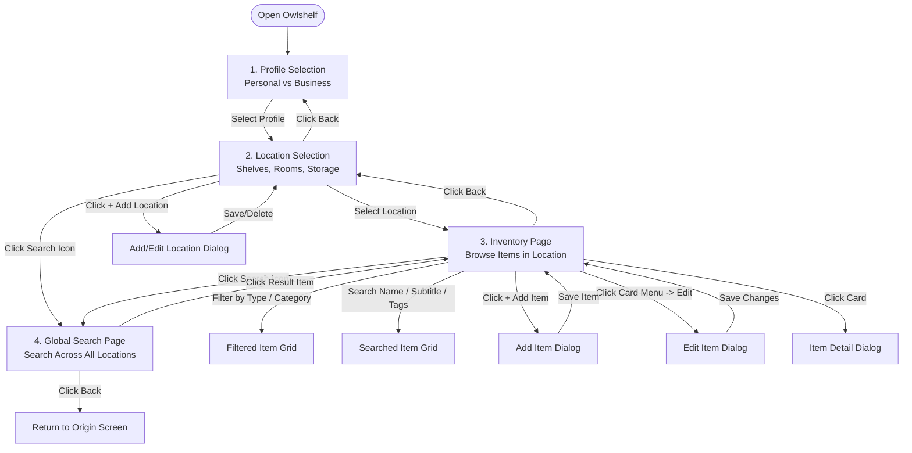
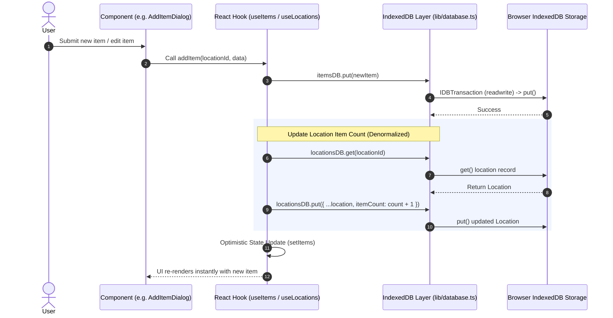
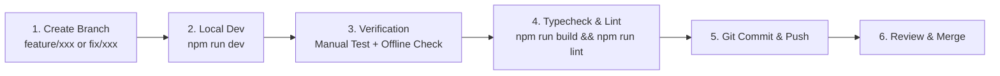

# Owlshelf — Project Documentation

> A dual-mode, offline-first inventory management app built with **Vite + React + TypeScript** on the frontend and **FastAPI + SQLite** on the backend.

---

## Table of Contents

1. [Overview](#overview)
2. [Tech Stack](#tech-stack)
3. [Project Structure](#project-structure)
4. [Getting Started](#getting-started)
5. [Application Workflows](#application-workflows)
   - [User Navigation & Feature Workflow](#user-navigation--feature-workflow)
   - [Data & Offline-First Mutation Workflow](#data--offline-first-mutation-workflow)
   - [Development & Contribution Workflow](#development--contribution-workflow)
6. [Frontend](#frontend)
   - [App Navigation Flow](#app-navigation-flow)
   - [Types (`src/types/`)](#types-srctypes)
   - [Data Layer (`src/data/`)](#data-layer-srcdata)
   - [Library / Utilities (`src/lib/`)](#library--utilities-srclib)
   - [Pages (`src/pages/`)](#pages-srcpages)
   - [Components (`src/components/`)](#components-srccomponents)
7. [Backend](#backend)
   - [Configuration](#configuration)
   - [Schemas](#schemas)
   - [Routers / Endpoints](#routers--endpoints)
8. [Database Design](#database-design)
9. [Coding Conventions](#coding-conventions)
10. [Adding New Features — Practical Guide](#adding-new-features--practical-guide)

---

## Overview

**Owlshelf** is a dual-mode inventory tracker that works fully offline. It stores all data in the browser's **IndexedDB**, which means the app is fully functional with no internet connection. An optional **FastAPI** backend exists for server-side sync and backup via **SQLite**.

**Key Features**:
- Profile-based access (Personal and Business modes)
- Organize items by custom **Locations** (shelves, rooms, warehouses)
- Track item **name, stock, condition, tags, category, image, and description**
- Filter items by type and category via an interactive sidebar
- **Global Search** — search across all locations in a profile from any screen
- Full-text search across name, subtitle, tags, category, and location name
- Add, edit, and delete items and locations — all persisted offline-first in IndexedDB

---

## Tech Stack

| Layer | Technology |
|---|---|
| Frontend Framework | React 19 + Vite 8 |
| Language | TypeScript 6 |
| Styling | Tailwind CSS v4 + PostCSS |
| UI Components | shadcn/ui + Lucide React icons |
| Class Utilities | `clsx` + `tailwind-merge` (via `cn()`) |
| Animations | Framer Motion |
| Local Database | IndexedDB (via raw IDB API, no extra library) |
| Backend Framework | FastAPI (Python) |
| Backend Database | SQLite (via `DATABASE_URL` in `.env`) |
| Backend Config | pydantic-settings |
| Backend Server | Uvicorn |
| Containerization | Containerfile (Podman/Docker compatible) + Nginx |

---

## Project Structure

```
owlshelf/
├── backend/                    # FastAPI backend (sync/backup server)
│   ├── app/
│   │   ├── __init__.py
│   │   ├── config.py           # App settings (pydantic-settings)
│   │   ├── schemas.py          # Pydantic request/response models
│   │   └── routers/
│   │       ├── __init__.py     # Exports items_router, users_router
│   │       ├── items.py        # GET/POST /items
│   │       └── users.py        # GET/POST /users
│   ├── main.py                 # FastAPI app factory
│   └── requirements.txt
│
└── frontend/
    └── owlshelf/
        ├── index.html
        ├── package.json
        ├── vite.config.ts
        └── src/
            ├── main.tsx            # React app entry point
            ├── App.tsx             # Root component — screen state machine
            ├── App.css             # All custom CSS classes
            ├── index.css           # Base styles / CSS variables
            │
            ├── types/
            │   └── item.ts         # All shared TypeScript types & interfaces
            │
            ├── data/
            │   ├── mockItems.ts    # Seed data (profiles, locations, items)
            │   └── database.ts     # Legacy single-store IDB wrapper (items only)
            │
            ├── lib/
            │   ├── database.ts     # Primary IDB service layer (multi-store)
            │   ├── useDB.ts        # React hooks: useProfiles, useLocations, useItems
            │   ├── useLocalStorage.ts  # Generic localStorage hook
            │   └── utils.ts        # cn() helper (clsx + tailwind-merge)
            │
            ├── pages/
            │   ├── ProfileSelectPage.tsx   # Screen 1: pick a profile
            │   ├── LocationSelectPage.tsx  # Screen 2: pick a location (+ global search button)
            │   ├── InventoryPage.tsx       # Screen 3: view & manage items (+ global search button)
            │   └── GlobalSearchPage.tsx   # Screen 4: search all items across all locations
            │
            └── components/
                ├── items/
                │   ├── AddItemDialog.tsx       # Add / Edit item modal
                │   ├── ItemCard.tsx            # Single item card with menu
                │   ├── ItemDetailDialog.tsx    # Full-screen item detail modal
                │   ├── ItemGrid.tsx            # Responsive grid of ItemCards
                │   └── SearchBar.tsx           # Controlled search input
                └── layout/
                    ├── Topbar.tsx             # Inventory page top navigation bar
                    ├── Sidebar.tsx            # Type + category filter panel
                    ├── AddLocationDialog.tsx  # Add / Edit / Delete location modal
                    └── TypewriterBrand.tsx    # Animated brand title component
```

---

## Getting Started

### Frontend

```bash
cd frontend/owlshelf

# Install dependencies
npm install

# Start dev server (http://localhost:5173)
npm run dev

# Build for production
npm run build

# Lint
npm run lint
```

### Backend

```bash
cd backend

# Create virtual environment (optional but recommended)
python -m venv .venv && source .venv/bin/activate

# Install dependencies
pip install -r requirements.txt

# Create a .env file
echo "DEBUG=True" > .env

# Start the server (http://127.0.0.1:8000)
python main.py
# or
uvicorn main:app --reload
```

### Environment Variables (backend `.env`)

| Variable | Default | Description |
|---|---|---|
| `APP_NAME` | `"OwlShelf API"` | Title shown in FastAPI docs |
| `DEBUG` | `False` | Enables Uvicorn hot-reload |
| `DATABASE_URL` | `"sqlite:///./dev.db"` | SQLAlchemy database URL |
| `SECRET_KEY` | `"change-me"` | Secret for signing tokens |

---

## Application Workflows

### User Navigation & Feature Workflow

This diagram illustrates the user's primary journey through the Owlshelf interface:



---

### Data & Offline-First Mutation Workflow

How data operations flow between the UI, React Hooks, and client-side IndexedDB:



---

### Development & Contribution Workflow

Recommended flow when adding features or fixing bugs:



1. **Branch out**: Create feature branch from `main` or active dev branch (e.g., `git checkout -b feature/item-tag-filter`).
2. **Local development**: Run `npm run dev` in `frontend/owlshelf`. Test components offline in browser DevTools.
3. **Follow coding conventions**:
   - Prefer `@/components/ui` primitives.
   - Use `cn()` for Tailwind class merges.
   - Always read/write data via `@/lib/useDB.ts` and `@/lib/database.ts`.
4. **Validation before committing**:
   - `npm run lint` — check ESLint rules.
   - `npm run build` — TypeScript typecheck and build validation.

---

## Frontend

### App Navigation Flow

`App.tsx` acts as a simple **screen state machine**. It holds the currently active `screen`, `activeProfile`, and `activeLocation` in state and renders the appropriate page:

```
ProfileSelectPage  →  (user picks profile)
  └── LocationSelectPage  →  (user picks location)    ─┐ search button in topbar
        │  (search icon in topbar)                      │ opens GlobalSearchPage
        │  └── GlobalSearchPage                         │
        └── InventoryPage  (back → LocationSelectPage) ─┘
              (search icon in topbar)
              └── GlobalSearchPage
```

```typescript
// App.tsx
type Screen = 'profile-select' | 'location-select' | 'inventory' | 'global-search'
```

| Handler | What it does |
|---|---|
| `handleProfileSelect(profile)` | Sets `activeProfile`, navigates to `'location-select'` |
| `handleLocationSelect(location)` | Sets `activeLocation`, navigates to `'inventory'` |
| `handleOpenSearch(origin)` | Records `searchOrigin`, navigates to `'global-search'` |
| `handleSearchBack()` | Returns to the screen stored in `searchOrigin` |
| `handleSearchNavigate(location)` | Sets `activeLocation`, navigates to `'inventory'` |

---

### Types (`src/types/`)

**File:** `src/types/item.ts`

All shared data types live here. Import from `@/types/item`.

#### `AccountType`
```typescript
type AccountType = "personal" | "business";
```
Determines the app's visual mode and label language (e.g. "copies" vs. "units").

---

#### `ItemType`
```typescript
type ItemType = "book" | "collection" | "electronics" | "clothing" | "food" | "other";
```
Used for type-based filtering in the Sidebar. Displayed via `ITEM_TYPE_LABELS`.

---

#### `Condition`
```typescript
type Condition = 1 | 2 | 3 | 4 | 5;
```
A numeric rating from 1 (Poor) to 5 (Pristine), rendered as dot indicators.

---

#### `Profile`
```typescript
interface Profile {
  id: string;          // e.g. "profile-personal"
  name: string;        // Display name
  type: AccountType;   // "personal" | "business"
  avatarEmoji: string; // e.g. "📚"
}
```

---

#### `Location`
```typescript
interface Location {
  id: string;          // e.g. "loc-home-shelf"
  profileId: string;   // Foreign key → Profile.id
  name: string;        // Display name
  icon: string;        // Emoji icon
  description: string;
  itemCount: number;   // Kept in sync on add/delete
}
```

---

#### `Item`
```typescript
interface Item {
  id: string;           // e.g. "item-abc1234"
  locationId: string;   // Foreign key → Location.id
  name: string;
  subtitle: string;     // Author, model, year, etc.
  description: string;
  stock: number;        // Quantity owned
  tags: string[];       // Free-form tags for filtering
  category: string;     // User-defined category label
  itemType: ItemType;
  condition: Condition;
  imageUrl?: string;    // Base64 data URL or external URL
}
```

---

#### `CategoryFilter`
```typescript
interface CategoryFilter {
  name: string;
  count: number;
}
```
Used by the Sidebar to render category filter buttons with item counts.

---

#### `ITEM_TYPE_LABELS`
```typescript
const ITEM_TYPE_LABELS: Record<ItemType, string> = {
  book: "Book",
  collection: "Collection",
  electronics: "Electronics",
  clothing: "Clothing",
  food: "Food",
  other: "Other",
};
```
Maps `ItemType` values to human-readable strings. Use this wherever you render an `ItemType`.

---

### Data Layer (`src/data/`)

#### `src/data/mockItems.ts`
Exports `mockProfiles`, `mockLocations`, and `mockItems` — the seed data used on first launch. These are inserted into IndexedDB during the `onupgradeneeded` event (version 1 only, so existing users are unaffected on updates).

**To add seed data:** Add entries to the relevant exported array. Remember to keep `locationId`/`profileId` references consistent.

---

#### `src/data/database.ts` *(Legacy)*
A simpler, single-store IndexedDB wrapper around an `"items"` object store named `"inventoryDB"`. This was an earlier implementation. **Prefer `src/lib/database.ts`** for all new code. This file may be refactored/removed in a future sprint.

| Export | Signature | Description |
|---|---|---|
| `initDatabase` | `() → Promise<IDBDatabase>` | Opens / creates the `"inventoryDB"` database |
| `getAllItems` | `() → Promise<Item[]>` | Returns all items |
| `getItemById` | `(id) → Promise<Item \| undefined>` | Returns one item by ID |
| `saveItem` | `(item) → Promise<void>` | Upserts an item |
| `deleteItem` | `(id) → Promise<void>` | Deletes an item by ID |

---

### Library / Utilities (`src/lib/`)

#### `src/lib/database.ts` — Primary IDB Service Layer

This is the **canonical** database module. It manages three IndexedDB object stores inside a single database (`owlshelf-db`, version 1).

**Object Stores:**

| Store | Key Path | Indexes |
|---|---|---|
| `profiles` | `id` | — |
| `locations` | `id` | `profileId` |
| `items` | `id` | `locationId` |

---

##### `openDB(): Promise<IDBDatabase>`
Singleton that opens (or creates) the `owlshelf-db` database. Returns the same promise on every call — safe to call concurrently. On first install (`oldVersion === 0`), seeds all three stores with data from `mockItems.ts`.

```typescript
import { openDB } from "@/lib/database";
const db = await openDB();
```

---

##### Generic Wrappers (internal)

These are internal helpers used by the typed store objects below. You should not need to call them directly.

| Function | Signature | Description |
|---|---|---|
| `dbGet<T>` | `(storeName, id) → Promise<T \| undefined>` | Gets one record by primary key |
| `dbGetAll<T>` | `(storeName) → Promise<T[]>` | Gets all records from a store |
| `dbGetByIndex<T>` | `(storeName, indexName, value) → Promise<T[]>` | Gets records matching an index value |
| `dbPut<T>` | `(storeName, record) → Promise<void>` | Upserts (add or update) a record |
| `dbDelete` | `(storeName, id) → Promise<void>` | Deletes a record by primary key |

---

##### Typed Store Objects

These are the **preferred API** for any component or hook that touches the database.

**`profilesDB`**
```typescript
profilesDB.getAll()          // → Promise<Profile[]>
profilesDB.put(profile)      // → Promise<void>
```

**`locationsDB`**
```typescript
locationsDB.getAll()                  // → Promise<Location[]>
locationsDB.getByProfile(profileId)   // → Promise<Location[]>
locationsDB.get(id)                   // → Promise<Location | undefined>
locationsDB.put(location)             // → Promise<void>
locationsDB.delete(id)                // → Promise<void>
```

**`itemsDB`**
```typescript
itemsDB.getAll()                      // → Promise<Item[]>
itemsDB.getByLocation(locationId)     // → Promise<Item[]>
itemsDB.get(id)                       // → Promise<Item | undefined>
itemsDB.put(item)                     // → Promise<void>
itemsDB.delete(id)                    // → Promise<void>
```

---

#### `src/lib/useDB.ts` — React Hooks

Provides three React hooks that wrap the IDB service layer. All hooks follow the same pattern: load data on mount, expose state, and return mutation functions that optimistically update React state after writing to IDB.

---

##### `useProfiles()`

```typescript
const { profiles, loading, error, addProfile } = useProfiles();
```

| Return | Type | Description |
|---|---|---|
| `profiles` | `Profile[]` | All profiles from IDB |
| `loading` | `boolean` | True while the initial load is pending |
| `error` | `string \| null` | Error message if IDB fails |
| `addProfile` | `(data: Omit<Profile, "id">) → Promise<void>` | Creates a new profile with an auto-generated ID |

**Example:**
```tsx
const { profiles, addProfile } = useProfiles();
await addProfile({ name: "Work", type: "business", avatarEmoji: "🏢" });
```

---

##### `useLocations(profileId: string)`

Scoped to a single profile. Re-fetches automatically when `profileId` changes.

```typescript
const { locations, loading, error, addLocation, updateLocation, deleteLocation } =
  useLocations(profile.id);
```

| Return | Type | Description |
|---|---|---|
| `locations` | `Location[]` | Locations belonging to `profileId` |
| `loading` | `boolean` | True while loading |
| `error` | `string \| null` | IDB error message |
| `addLocation` | `(data: Omit<Location, "id" \| "itemCount">) → Promise<Location>` | Creates a location (itemCount starts at 0) |
| `updateLocation` | `(updated: Location) → Promise<void>` | Upserts and refreshes local state |
| `deleteLocation` | `(id: string) → Promise<void>` | Deletes and removes from local state |

**Example:**
```tsx
const { addLocation } = useLocations(profile.id);
const newLoc = await addLocation({
  profileId: profile.id,
  name: "Bedroom Shelf",
  icon: "🛏️",
  description: "Books on the nightstand",
});
```

---

##### `useItems(locationId: string)`

Scoped to a single location. Re-fetches when `locationId` changes. `addItem` also increments the parent `Location.itemCount` automatically. `deleteItem` decrements it.

```typescript
const { items, loading, error, addItem, updateItem, deleteItem } =
  useItems(location.id);
```

| Return | Type | Description |
|---|---|---|
| `items` | `Item[]` | Items belonging to `locationId` |
| `loading` | `boolean` | True while loading |
| `error` | `string \| null` | IDB error message |
| `addItem` | `(locationId, data: NewItemData) → Promise<void>` | Creates item, increments location's `itemCount` |
| `updateItem` | `(updated: Item) → Promise<void>` | Upserts item and refreshes local state |
| `deleteItem` | `(id: string) → Promise<void>` | Deletes item, decrements location's `itemCount` |

**`NewItemData` interface** (all fields optional except `name`):
```typescript
interface NewItemData {
  name: string;
  subtitle?: string;
  description?: string;
  stock?: number;          // default: 1
  tags?: string[];         // default: []
  category?: string;       // default: "Uncategorized"
  itemType?: ItemType;     // default: "other"
  condition?: Condition;   // default: 3
  imageUrl?: string;
}
```

**Example:**
```tsx
const { addItem } = useItems(location.id);
await addItem(location.id, {
  name: "Dune",
  subtitle: "Frank Herbert · 1965",
  stock: 2,
  tags: ["Sci-Fi", "Classic"],
  itemType: "book",
  condition: 4,
});
```

---

#### `src/lib/useLocalStorage.ts`

A generic hook that syncs any value to `localStorage` as JSON.

```typescript
function useLocalStorage<T>(key: string, initialValue: T): [T, Dispatch<SetStateAction<T>>]
```

Behaves exactly like `useState`, but the value is read from (and written to) `localStorage[key]` automatically.

```tsx
const [theme, setTheme] = useLocalStorage("theme", "dark");
```

---

#### `src/lib/utils.ts`

```typescript
function cn(...inputs: ClassValue[]): string
```

Merges Tailwind CSS class strings. Uses `clsx` for conditional classes and `tailwind-merge` to resolve conflicts. **Always use `cn()` instead of manual string concatenation** when building class names.

```tsx
<div className={cn("base-class", isActive && "active-class", someCondition ? "a" : "b")} />
```

---

### Pages (`src/pages/`)

#### `ProfileSelectPage`

**File:** `src/pages/ProfileSelectPage.tsx`

The app's landing screen. Displays a card for each profile loaded from IndexedDB.

| Prop | Type | Description |
|---|---|---|
| `onSelect` | `(profile: Profile) → void` | Called when the user clicks a profile card |

- Uses `useProfiles()` to load profiles.
- Shows skeleton cards while `loading === true`.
- Each card has a unique `id` of `profile-{profile.id}`.
- Renders the `TypewriterBrand` animated header and app logo.

---

#### `LocationSelectPage`

**File:** `src/pages/LocationSelectPage.tsx`

Shows all locations for the active profile. Allows creating, editing, and deleting locations. The topbar shows the Owlshelf logo and a **Search icon button** for global search.

| Prop | Type | Description |
|---|---|---|
| `profile` | `Profile` | The currently active profile |
| `onSelectLocation` | `(location: Location) → void` | Called when the user clicks a location card |
| `onBack` | `() → void` | Navigates back to `ProfileSelectPage` |
| `onOpenSearch` | `() → void` | Opens the `GlobalSearchPage` |

**Internal state:**
- `addDialogOpen` — controls `AddLocationDialog` visibility
- `editingLocation` — the `Location` being edited, or `null` for add mode

**Key handlers:**

| Handler | Description |
|---|---|
| `handleEditClick(e, loc)` | Stops event propagation, sets `editingLocation`, opens dialog |
| `handleSaveLocation(data)` | Calls `updateLocation` or `addLocation` depending on edit/add mode |
| `handleCloseDialog()` | Closes dialog and resets `editingLocation` |

---

#### `InventoryPage`

**File:** `src/pages/InventoryPage.tsx`

The main view. Displays items in a grid with filtering, searching, and CRUD operations. The `Topbar` contains both an **Add Item** button and a **Search icon button** for global search.

| Prop | Type | Description |
|---|---|---|
| `profile` | `Profile` | Active profile |
| `location` | `Location` | Active location |
| `onBack` | `() → void` | Returns to `LocationSelectPage` |
| `onOpenSearch` | `() → void` | Opens the `GlobalSearchPage` |

**Internal state:**

| State | Type | Purpose |
|---|---|---|
| `activeCategory` | `string \| null` | Selected category filter (`null` = All) |
| `activeType` | `ItemType \| "all"` | Selected item-type filter |
| `searchQuery` | `string` | Live search string |
| `addDialogOpen` | `boolean` | Controls `AddItemDialog` visibility |
| `editingItem` | `Item \| null` | Item in edit mode; `null` = add mode |
| `detailItem` | `Item \| null` | Item shown in `ItemDetailDialog` |

**`visibleItems` (memoized):** Filters `items` through three passes — by type, then by category/tag, then by search query (matches `name`, `subtitle`, or any `tag`).

**`categories` (memoized):** Computes `CategoryFilter[]` from the currently filtered type subset, used to populate the Sidebar.

**Key handlers:**

| Handler | Description |
|---|---|
| `handleDelete(id)` | Deletes item, clears `detailItem` if it's the deleted item |
| `handleEdit(item)` | Sets `editingItem` and opens add dialog in edit mode |
| `handleDialogClose()` | Closes dialog and resets `editingItem` |
| `handleSaveItem(data)` | Calls `updateItem` (edit) or `addItem` (new) based on `editingItem` |

---

#### `GlobalSearchPage`

**File:** `src/pages/GlobalSearchPage.tsx`

A dedicated full-page search experience that searches **all items across all locations** for the active profile.

| Prop | Type | Description |
|---|---|---|
| `profile` | `Profile` | The profile whose items will be searched |
| `onBack` | `() → void` | Returns to the previous screen (`location-select` or `inventory`) |
| `onNavigateToLocation` | `(location: Location) → void` | Called when user clicks a result; navigates to that location's inventory |

**Internal state:**
- `query` — the current search string
- `allItems` — all items enriched with their location name and icon, loaded once on mount
- `loading` — true while the async load is in progress

**Data flow:**
1. On mount, calls `locationsDB.getByProfile(profile.id)` to build a `locationId → Location` map.
2. Calls `itemsDB.getAll()` and filters to only items whose `locationId` is in the map.
3. Each result item is enriched into `EnrichedItem` (extends `Item` with `locationName`, `locationIcon`, `location`).
4. `results` is `useMemo`-derived — re-computed on every `query` change, no debounce needed.

**Search matches:** item `name`, `subtitle`, `description`, `tags[]`, `category`, and `locationName`.

**UI states:**
- **Idle** (empty query) — shows a Search icon and hint text with total item count.
- **Loading** — shows a spinner while the async IDB load is in progress.
- **Results** — shows a scrollable list of `EnrichedItem` rows with thumbnail, name, subtitle, location badge, tag pill, and stock count.
- **Empty** — shown when query has text but no results match.

Clicking a result calls `onNavigateToLocation(item.location)`, which sets `activeLocation` and navigates to `'inventory'` in `App.tsx`.

---

### Components (`src/components/`)

#### `components/items/`

---

##### `AddItemDialog`

**File:** `src/components/items/AddItemDialog.tsx`

A modal dialog for adding a new item or editing an existing one.

| Prop | Type | Description |
|---|---|---|
| `open` | `boolean` | Controls dialog visibility |
| `locationName` | `string` | Shown in the dialog subtitle |
| `editItem` | `Item \| null \| undefined` | If provided, pre-fills form fields (edit mode) |
| `onClose` | `() → void` | Called on cancel or after save |
| `onSave` | `(data: Partial<Item>) → void` | Called with the collected form data |

**Behaviour:**
- `useEffect` on `[editItem, open]` resets or pre-fills all controlled fields.
- `handleImageUpload` uses `FileReader` to convert the selected file to a Base64 data URL stored in state.
- `handleSave` reads uncontrolled `<input>` values by DOM ID, then calls `onSave`.
- Clicking the backdrop (outside the dialog card) closes the dialog.

**Controlled fields (state):** `quantity`, `condition`, `itemType`, `category`, `imageUrl`.
**Uncontrolled fields (read by DOM ID):** `field-name`, `field-subtitle`, `field-tags`, `field-category`, `field-desc`.

---

##### `ItemCard`

**File:** `src/components/items/ItemCard.tsx`

A card that renders a single inventory item.

| Prop | Type | Description |
|---|---|---|
| `item` | `Item` | The item to display |
| `onClick` | `() → void` | Opens `ItemDetailDialog` |
| `onEdit` | `(item: Item) → void` | Opens `AddItemDialog` in edit mode |
| `onDelete` | `(id: string) → void` | Deletes the item |

**Features:**
- Shows a thumbnail image or a placeholder `Diamond` icon.
- Displays a stock badge (`×N`) when `stock > 1`.
- Three-dot menu (`MoreHorizontal`) toggles a dropdown with **Edit** and **Delete** actions. The menu is isolated from the card's `onClick` using `stopPropagation`.
- `ConditionDots` sub-component renders 5 dots, filled to the item's `condition` value.

---

##### `ItemDetailDialog`

**File:** `src/components/items/ItemDetailDialog.tsx`

A read-only detail modal for viewing all item fields.

| Prop | Type | Description |
|---|---|---|
| `item` | `Item \| null` | Item to display; `null` renders nothing |
| `onClose` | `() → void` | Closes the dialog |
| `onEdit` | `(item: Item) → void` | Closes this dialog, then opens edit mode |

Renders: image/placeholder, type pill, all tags, name, subtitle, description, condition dots, category, and an **Edit Item** button.

---

##### `ItemGrid`

**File:** `src/components/items/ItemGrid.tsx`

Renders a responsive CSS grid of `ItemCard` components.

| Prop | Type | Description |
|---|---|---|
| `items` | `Item[]` | Array of items to render |
| `onItemClick` | `(item: Item) → void` | Forwarded to each `ItemCard` |
| `onEdit` | `(item: Item) → void` | Forwarded to each `ItemCard` |
| `onDelete` | `(id: string) → void` | Forwarded to each `ItemCard` |

Shows an empty-state message (`"No items found."`) when `items.length === 0`.

---

##### `SearchBar`

**File:** `src/components/items/SearchBar.tsx`

A controlled search input with a clear button.

| Prop | Type | Description |
|---|---|---|
| `value` | `string` | Current search query |
| `onChange` | `(value: string) → void` | Called on every keystroke and on clear |

The clear button (`X` icon) only renders when `value` is non-empty.

---

#### `components/layout/`

---

##### `Topbar`

**File:** `src/components/layout/Topbar.tsx`

Top navigation bar for the Inventory screen. Displays the Owlshelf logo, a breadcrumb trail, a Search icon, and the Add Item button.

| Prop | Type | Description |
|---|---|---|
| `profile` | `Profile` | Used to render the breadcrumb |
| `location` | `Location` | Used to render the breadcrumb |
| `onBack` | `() → void` | Back button handler |
| `onAddItem` | `() → void` | "Add Item" button handler |
| `onOpenSearch` | `() → void` | Search icon button handler — opens `GlobalSearchPage` |

Renders: `← back` · Owlshelf logo · `{profile.name} › {icon} {location.name}` · Search icon · Add Item button.

---

##### `Sidebar`

**File:** `src/components/layout/Sidebar.tsx`

Left-panel filter sidebar for the Inventory screen.

| Prop | Type | Description |
|---|---|---|
| `categories` | `CategoryFilter[]` | Category list with counts |
| `activeCategory` | `string \| null` | Currently selected category |
| `onCategoryChange` | `(cat: string \| null) → void` | Called on category click (toggle off by passing current) |
| `activeType` | `ItemType \| "all"` | Currently selected item type |
| `onTypeChange` | `(type: ItemType \| "all") → void` | Called when type dropdown changes |

Changing the item type via the dropdown resets the category filter to `null` (handled in `InventoryPage`).

---

##### `AddLocationDialog`

**File:** `src/components/layout/AddLocationDialog.tsx`

Modal dialog for adding, editing, or deleting a location.

| Prop | Type | Description |
|---|---|---|
| `open` | `boolean` | Controls visibility |
| `profile` | `Profile` | Used to set `profileId` on save |
| `editLocation` | `Location \| null \| undefined` | Pre-fills form in edit mode |
| `onClose` | `() → void` | Called after save, delete, or cancel |
| `onSave` | `(data: Omit<Location, "id" \| "itemCount">) → Promise<Location \| void>` | Async save handler |
| `onDelete` | `((id: string) → Promise<void>) \| undefined` | If provided, shows a red "Delete Location" button in the footer (edit mode only) |

**Behaviour:**
- `useEffect` on `[editLocation, open]` resets or pre-fills controlled fields.
- Icon can be selected from `ICON_PRESETS` (emoji grid) or typed manually (max 4 chars).
- Location name is required; shows an inline error if blank on submit.
- Delete button only appears in edit mode (`editLocation` is set) and only when `onDelete` is provided.
- Delete prompts a `window.confirm` before calling `onDelete`, then closes the dialog.

---

##### `TypewriterBrand`

**File:** `src/components/layout/TypewriterBrand.tsx`

Animated brand title used on the `ProfileSelectPage`.

| Prop | Type | Description |
|---|---|---|
| `text` | `string` | The brand text to animate letter-by-letter |

**Behaviour:**
- Each letter animates in with a staggered `easeOut` fade + slide (`delay = index * 0.1s`).
- On hover (or tap on mobile), all letters glow gold (`#D4AF37`) via Framer Motion `variants`.
- A blinking cursor renders to the right of the text.
- Responsive: font size and cursor height shrink below `768px` viewport width.

```tsx
<TypewriterBrand text="Owlshelf" />
```

---

## Backend

The backend is a **FastAPI** application intended for server-side sync and backup. It is currently scaffold-level and uses in-memory stores — wire up SQLAlchemy/SQLite when ready.

### Configuration

**File:** `backend/app/config.py`

Settings are loaded from a `.env` file using `pydantic-settings`. A singleton `settings` object is instantiated at import time and attached to `app.state.settings` in the app factory.

```python
from app.config import settings
print(settings.DATABASE_URL)  # "sqlite:///./dev.db"
```

---

### Schemas

**File:** `backend/app/schemas.py`

Pydantic models for request validation and response serialization.

| Schema | Fields | Usage |
|---|---|---|
| `Item` | `id: int`, `name: str`, `description: str \| None` | Response model |
| `ItemCreate` | `name: str`, `description: str \| None` | Request body for POST `/items` |
| `User` | `id: int`, `username: str`, `email: EmailStr` | Response model |
| `UserCreate` | `username: str`, `email: EmailStr` | Request body for POST `/users` |

---

### Routers / Endpoints

#### Items — `GET /items/` and `POST /items/`

**File:** `backend/app/routers/items.py`

| Method | Path | Request Body | Response |
|---|---|---|---|
| `GET` | `/items/` | — | `List[Item]` |
| `POST` | `/items/` | `ItemCreate` | `Item` (201) |

Currently uses an in-memory list. Replace `_items` with a SQLAlchemy session query.

#### Users — `GET /users/` and `POST /users/`

**File:** `backend/app/routers/users.py`

| Method | Path | Request Body | Response |
|---|---|---|---|
| `GET` | `/users/` | — | `List[User]` |
| `POST` | `/users/` | `UserCreate` | `User` (201) |

Currently uses an in-memory list. Replace `_users` with a SQLAlchemy session query.

> **Interactive API docs** are auto-generated by FastAPI at `http://127.0.0.1:8000/docs`.

---

## Database Design

### IndexedDB (`owlshelf-db`)

```
Database: owlshelf-db  (version 1)
│
├── profiles        (keyPath: "id")
│     No indexes
│     └── Profile { id, name, type, avatarEmoji }
│
├── locations       (keyPath: "id")
│     Index: profileId (non-unique)
│     └── Location { id, profileId, name, icon, description, itemCount }
│
└── items           (keyPath: "id")
      Index: locationId (non-unique)
      └── Item { id, locationId, name, subtitle, description,
                 stock, tags, category, itemType, condition, imageUrl? }
```

**Relationships:**
- `Profile` → `Location` (one-to-many, joined via `profileId` index)
- `Location` → `Item` (one-to-many, joined via `locationId` index)
- `Location.itemCount` is a **denormalized counter** kept in sync by `addItem` (+1) and `deleteItem` (-1)

---

## Coding Conventions

| Rule | Detail |
|---|---|
| **Primary DB module** | Always use `@/lib/database.ts` typed store objects, not `@/data/database.ts` |
| **React hooks for DB** | Use `useProfiles`, `useLocations`, `useItems` from `@/lib/useDB.ts` in components |
| **Class utilities** | Always use `cn()` from `@/lib/utils.ts` to merge Tailwind classes |
| **Icons** | Use `lucide-react` icons; keep `strokeWidth` consistent (typically `2` or `2.5`) |
| **Type imports** | Use `import type { ... }` for type-only imports |
| **shadcn/ui first** | Check `@/components/ui` before building a new UI primitive |
| **Offline-first** | Never make a component depend on the backend being available |
| **No overwriting IDB** | Do not bulk-replace IDB data without a sync conflict check |
| **CSS variable tokens** | Use CSS variables (`var(--danger)`, etc.) defined in `index.css` / `App.css` |

---

## Adding New Features — Practical Guide

### Add a new Item field

1. **Type:** Add the field to the `Item` interface in `src/types/item.ts`.
2. **Seed data:** Add the field (with a default) to all objects in `src/data/mockItems.ts`.
3. **Form:** Add an input field to `AddItemDialog.tsx`.
   - Controlled field (dropdown, stepper): add to component state.
   - Simple text input: add as uncontrolled and read it by DOM ID in `handleSave`.
4. **Display:** Show the field in `ItemCard.tsx` and/or `ItemDetailDialog.tsx`.
5. **IDB schema bump:** If a new *index* is needed, increment `DB_VERSION` in `src/lib/database.ts` and add an upgrade branch in `onupgradeneeded`.

---

### Add a new Location

1. Update the location card UI in `LocationSelectPage.tsx` if needed.
2. Call `addLocation(data)` from `useLocations`.

---

### Add a new Profile type

1. Extend the `AccountType` union in `src/types/item.ts`.
2. Add a branch in `ProfileSelectPage.tsx` for the new card style.
3. Update any `profile.type === "personal"` comparisons in `InventoryPage.tsx`.

---

### Add a new backend endpoint

1. Create a new router file in `backend/app/routers/`.
2. Define the Pydantic schema in `backend/app/schemas.py`.
3. Import and register the router in `backend/app/routers/__init__.py` and `backend/main.py`.

---

*Last updated: 2026-07-29*
